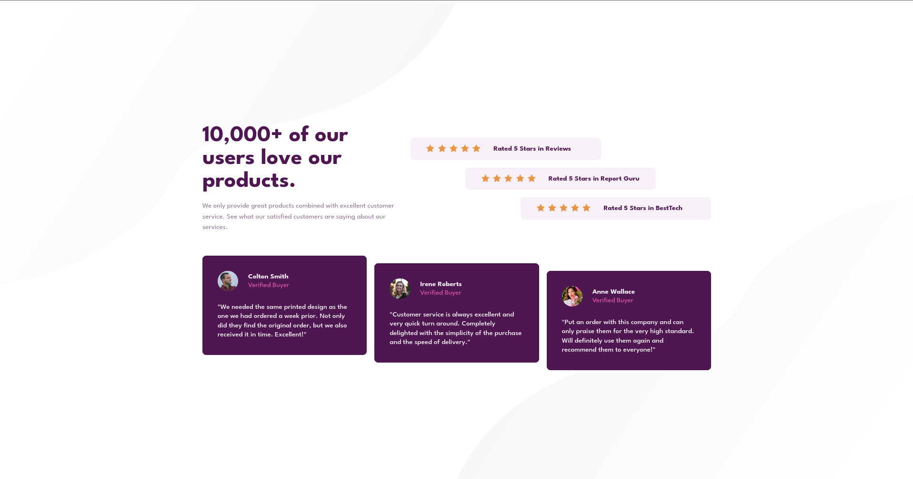

# [Frontend Mentor - Social proof section solution](https://ils01.github.io/social-proof-section)



This is a solution to the [Social proof section challenge on Frontend Mentor](https://www.frontendmentor.io/challenges/social-proof-section-6e0qTv_bA). Frontend Mentor challenges help you improve your coding skills by building realistic projects.

### What I learned

- `aria-hidden` attribute

- `transform: translate` property

- ```css
  .flow-content > * + * {
    //...
  }
  ```

## Acknowledgments

[cool guide](https://youtu.be/K27WULzr2P8)
